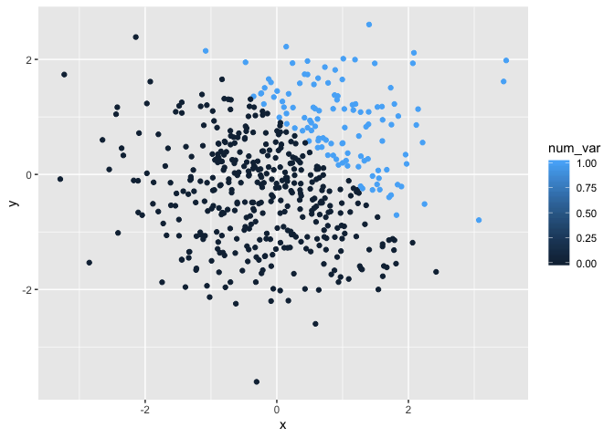
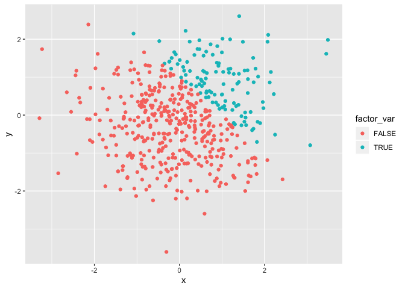

p8105\_hw1\_rs4025
================
Rebecca Silva
9/12/2019

# Problem 1

``` r
#load packages
library(tidyverse)
```

    ## ── Attaching packages ────────────────────────────────── tidyverse 1.2.1 ──

    ## ✔ ggplot2 3.2.1     ✔ purrr   0.3.2
    ## ✔ tibble  2.1.3     ✔ dplyr   0.8.3
    ## ✔ tidyr   0.8.3     ✔ stringr 1.4.0
    ## ✔ readr   1.3.1     ✔ forcats 0.4.0

    ## ── Conflicts ───────────────────────────────────── tidyverse_conflicts() ──
    ## ✖ dplyr::filter() masks stats::filter()
    ## ✖ dplyr::lag()    masks stats::lag()

``` r
#create data frame
df1 = tibble(
  norm_samp = rnorm(8),
  norm_samp_log = norm_samp > 0,
  char_var = as.character(norm_samp), 
  factor_var =  factor( c( "grp1", "grp2", "grp3", "grp3", "grp2", "grp1", "grp2", "grp3" ))
)

#try taking mean of each var
mean(pull (df1, norm_samp))
mean(pull (df1, norm_samp_log))
mean(pull (df1, char_var))
```

    ## Warning in mean.default(pull(df1, char_var)): argument is not numeric or
    ## logical: returning NA

``` r
mean(pull (df1, factor_var))
```

    ## Warning in mean.default(pull(df1, factor_var)): argument is not numeric or
    ## logical: returning NA

``` r
#convert vars 
as.numeric(pull (df1, norm_samp_log))
as.numeric(pull (df1, char_var))
as.numeric(pull (df1, factor_var))
```

When trying to take the mean of each variable before converting, the
output for the character and factor vector are ’NA’s, and I receive a
warning message. R is able to take the mean of the logical vector
because TRUE and FALSE are coded as 1’s and 0’s, respectively.

Using ‘as.numeric’ converts

  - the logicals into integers of 0 (false) and 1 (true).
  - the characters into a numeric value.
  - the factors into the numeric value of their assigned level.

Essentially, the function tries to convert each element of a vector into
a number. Without converting the variables into a number, R is unable to
take the mean, and therefore we get an error.

``` r
#logical to numeric
logical_num = as.numeric(pull (df1, norm_samp_log))

pull( df1, norm_samp) * logical_num
```

    ## [1] 0.0000000 1.3496278 0.0000000 0.0000000 1.3361128 0.9889986 2.3299078
    ## [8] 0.0000000

``` r
#logical to factor
logical_factor = as.factor(pull (df1, norm_samp_log))

pull( df1, norm_samp) * logical_factor #not possible
```

    ## Warning in Ops.factor(pull(df1, norm_samp), logical_factor): '*' not
    ## meaningful for factors

    ## [1] NA NA NA NA NA NA NA NA

``` r
#logical to factor to numeric
logical_factor_num = as.numeric( 
  as.factor( pull (df1, norm_samp_log))
)

pull( df1, norm_samp) * logical_factor_num
```

    ## [1] -0.7569245  2.6992555 -0.4545845 -0.4595273  2.6722255  1.9779972
    ## [7]  4.6598157 -0.6532871

# Problem 2

``` r
# create dataframe
df2 = tibble(
  x = rnorm(500),
  y = rnorm(500),
  log_var = x + y > 1, 
  num_var = as.numeric(log_var),
  factor_var = as.factor(log_var)
)
```

The data frame, ‘df2’, has 500 rows and 5 columns. The mean of x is
0.0281359, the median of x is 0.0431604, and the standard deviation of x
is 1.0521086. The proportion of cases for which \(x+y > 1\) is 0.23.

``` r
# scatter plot 1 - color by logical 
ggplot(df2, aes(x = x, y = y, color = log_var)) + geom_point()
```

<!-- -->

``` r
#export first scatter plot
ggsave("scatter_plot_hw1.pdf", height = 4, width = 6) 

# scatter plot 2 - color by numeric 
ggplot(df2, aes(x = x, y = y, color = num_var)) + geom_point()
```

<!-- -->

``` r
# scatter plot 3 - color by factor 
ggplot(df2, aes(x = x, y = y, color = factor_var)) + geom_point()
```

<!-- -->

The color scales for the factor and logical variables are discrete,
using two colors to represent ‘False’/‘True’ and ‘0’/‘1’, respectively.
The color scale for the numeric vector is continuous where darker hues
of blue indicate values closer to 0 and lighter hues indicate values of
the numeric vector that are closer to 1.
