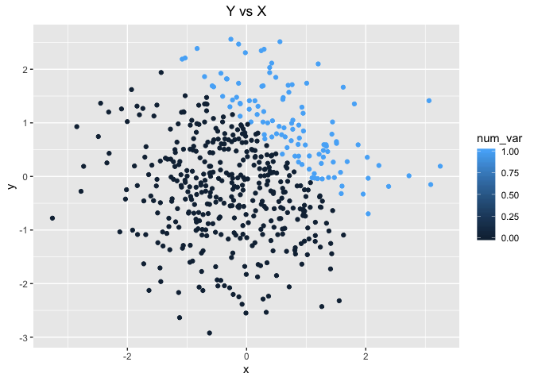
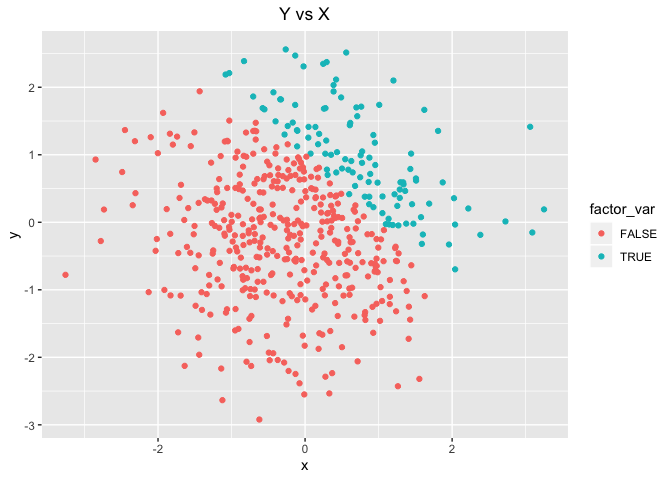

p8105\_hw1\_rs4025
================
Rebecca Silva

# Problem 1

``` r
#create data frame
df1 = tibble(
  norm_samp = rnorm(8),
  norm_samp_log = norm_samp > 0,
  char_var = as.character(norm_samp), 
  factor_var =  factor( c( "grp1", "grp2", "grp3", "grp3", "grp2", "grp1", "grp2", "grp3" ))
)
```

``` r
#try taking mean of each var
mean(pull (df1, norm_samp))
```

    ## [1] 0.4855753

``` r
mean(pull (df1, norm_samp_log))
```

    ## [1] 0.875

``` r
mean(pull (df1, char_var))
```

    ## [1] NA

``` r
mean(pull (df1, factor_var))
```

    ## [1] NA

When trying to take the mean of each variable before converting, the
output for the character and factor vector are NA’s, and I receive a
warning message. We can obtain a mean for the numeric vector, as it is
numeric, and the logical vector because TRUE and FALSE are converted to
values 1 and 0, respectively, when used in the function.

Essentially, the function tries to convert each element of the vector
into a number. Without converting the variables into a number, R is
unable to take the mean, and therefore we get an error.

``` r
#convert vars 
as.numeric(pull (df1, norm_samp_log))
as.numeric(pull (df1, char_var))
as.numeric(pull (df1, factor_var))
```

Using ‘as.numeric’ converts the logicals into integers of 0 (false) and
1 (true). It tries to convert the characters into a numeric value, if it
cannot, it assigns the object into an ‘NA’. In my example, the
characters are in the form “1.235” so it is converted to the number
1.235. However, if the character is “Hi”, for example, the numeric
conversion would be NA. Lastly, the as.numeric function converts the
factors into the numeric value of their assigned level.

``` r
#logical to numeric
logical_num = as.numeric(pull (df1, norm_samp_log))
# multiply rand samp by result
pull( df1, norm_samp) * logical_num
```

    ## [1] 0.06427612 0.54557286 0.57181596 0.31363639 0.60971125 0.00000000
    ## [7] 1.55089135 0.74034912

``` r
#logical to factor
logical_factor = as.factor(pull (df1, norm_samp_log))
# multiply rand samp by result
pull( df1, norm_samp) * logical_factor #not possible
```

    ## [1] NA NA NA NA NA NA NA NA

``` r
#logical to factor to numeric
logical_factor_num = as.numeric( 
  as.factor( pull (df1, norm_samp_log)))
# multiply rand samp by result
pull( df1, norm_samp) * logical_factor_num
```

    ## [1]  0.1285522  1.0911457  1.1436319  0.6272728  1.2194225 -0.5116508
    ## [7]  3.1017827  1.4806982

Similar to when we were trying to find the mean of a factor variable,
multiplying a numeric variable by a factor variable will not work since
multiplication does not work on anything other than a number.

# Problem 2

``` r
# create dataframe
df2 = tibble(
  x = rnorm(500),
  y = rnorm(500),
  log_var = x + y > 1, 
  num_var = as.numeric(log_var),
  factor_var = as.factor(log_var)
)
```

The data frame, ‘df2’, has 500 rows and 5 columns. The mean of x is
about -0.09, the median of x is about -0.101, and the standard deviation
of x is about 0.991. The proportion of cases for which x+y \> 1 is 0.22.

``` r
# scatter plot 1 - color by logical 
ggplot(df2, aes(x = x, y = y, color = log_var)) + 
  geom_point() + 
  ggtitle("Y vs X") +
  theme(plot.title = element_text(hjust = 0.5))
```

<!-- -->

``` r
#export first scatter plot
ggsave("scatter_plot_hw1.pdf", height = 4, width = 6) 

# scatter plot 2 - color by numeric 
ggplot(df2, aes(x = x, y = y, color = num_var)) + 
  geom_point() + 
  ggtitle("Y vs X") +
  theme(plot.title = element_text(hjust = 0.5))
```

<!-- -->

``` r
# scatter plot 3 - color by factor 
ggplot(df2, aes(x = x, y = y, color = factor_var)) + 
  geom_point() + 
  ggtitle("Y vs X") +
  theme(plot.title = element_text(hjust = 0.5))
```

<!-- -->

The color scales for the factor and logical variables are discrete,
using two colors to represent ‘False’ and ‘True’ with red and blue,
respectively. The color scale for the numeric vector is continuous;
darker hues of blue indicate values closer to 0 and lighter hues
indicate values of the numeric vector that are closer to 1.
